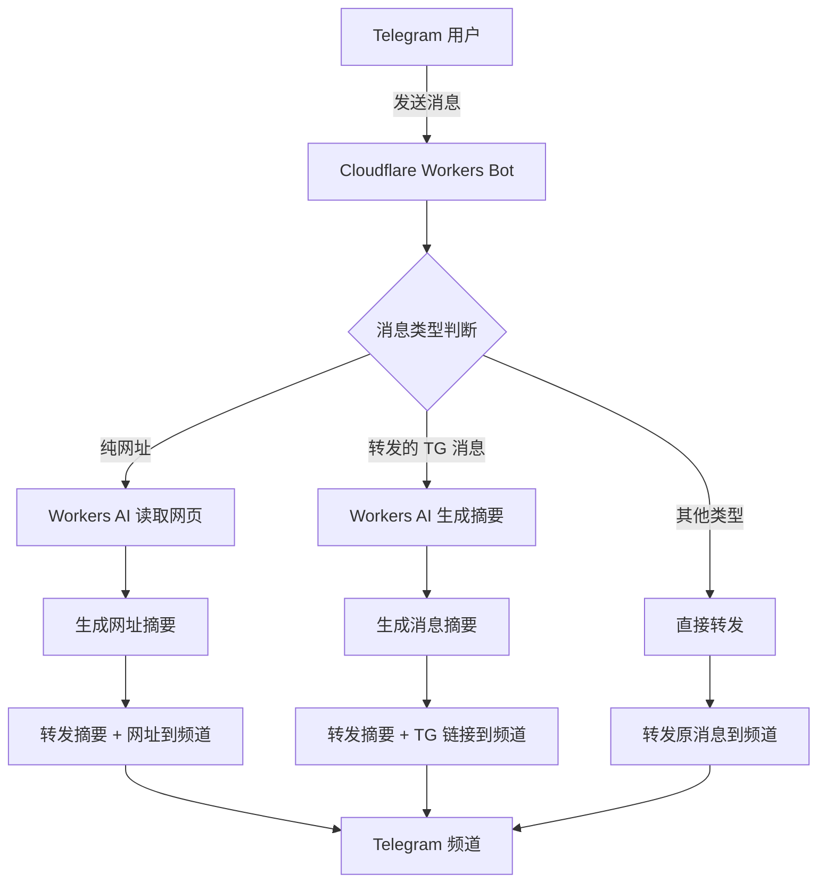

# Telegram Bot 内容转发功能

Feature Name: tg-bot-content-forwarder
Updated: 2026-05-09

## Implementation Status

已完成核心代码实现：

- ✅ `src/index.ts` - Webhook 处理和路由
- ✅ `src/types.ts` - TypeScript 类型定义和消息分类逻辑
- ✅ `src/ai-processor.ts` - Workers AI 内容摘要生成
- ✅ `src/telegram-client.ts` - Telegram Bot API 封装
- ✅ `src/forward-handler.ts` - 消息转发处理器
- ✅ `wrangler.toml` - Cloudflare Workers 配置
- ✅ `package.json` - 项目依赖配置

## Description

基于 Cloudflare Workers 平台实现的 Telegram Bot，能够智能识别用户发送的消息类型，并借助 Workers AI 对纯网址和转发的 Telegram 消息生成简短摘要，最终将处理后的内容转发到指定的 Telegram 频道。

## Architecture



### 工作流程

1. **消息接收**: Bot 通过 Telegram Bot API 的 Webhook 接收用户消息
2. **类型判断**: 分析消息内容，判断是纯网址、转发的 TG 消息还是其他类型
3. **AI 处理**: 对需要摘要的消息类型，调用 Workers AI 进行处理
4. **内容转发**: 将处理后的内容转发到配置的 Telegram 频道

## Components and Interfaces

### 1. Webhook Handler (`index.ts`)

```typescript
interface Env {
  TELEGRAM_BOT_TOKEN: string;
  TELEGRAM_CHANNEL_ID: string;
  WORKERS_AI_MODEL: string;
  SUMMARY_MAX_LENGTH: string;
  REQUEST_TIMEOUT: string;
}

export default {
  async fetch(request: Request, env: Env): Promise<Response> {
    // 处理 Telegram Webhook
  }
}
```

### 2. 消息类型判断模块 (`message-classifier.ts`)

```typescript
interface MessageClassification {
  type: 'url' | 'forwarded' | 'other';
  url?: string;
  forwardedFrom?: string;
  originalMessage?: TelegramMessage;
}

function classifyMessage(message: TelegramMessage): MessageClassification;
function isPureUrl(text: string): boolean;
```

### 3. Workers AI 处理模块 (`ai-processor.ts`)

```typescript
interface AIProcessor {
  summarizeUrl(url: string, maxLength: number): Promise<string>;
  summarizeMessage(content: string, maxLength: number): Promise<string>;
  fetchUrlContent(url: string): Promise<string>;
}
```

### 4. Telegram API 模块 (`telegram-client.ts`)

```typescript
interface TelegramClient {
  sendMessage(chatId: string, text: string): Promise<void>;
  forwardMessage(chatId: string, fromChatId: string, messageId: number): Promise<void>;
  getWebhookInfo(): Promise<WebhookInfo>;
}
```

### 5. 转发处理器 (`forward-handler.ts`)

```typescript
interface ForwardHandler {
  handleUrlMessage(url: string): Promise<void>;
  handleForwardedMessage(message: TelegramMessage): Promise<void>;
  handleOtherMessage(message: TelegramMessage): Promise<void>;
}
```

## Data Models

### Telegram Message 结构

```typescript
interface TelegramMessage {
  message_id: number;
  from?: User;
  chat: Chat;
  date: number;
  text?: string;
  entities?: MessageEntity[];
  forward_from?: User;
  forward_from_chat?: Chat;
  forward_from_message_id?: number;
  photo?: PhotoSize[];
  video?: Video;
  document?: Document;
  audio?: Audio;
}

interface User {
  id: number;
  is_bot: boolean;
  first_name: string;
  last_name?: string;
  username?: string;
}

interface Chat {
  id: number;
  type: 'private' | 'group' | 'supergroup' | 'channel';
}
```

### 消息分类结果

```typescript
interface ClassificationResult {
  type: 'url' | 'forwarded' | 'other';
  confidence: number;
  data: {
    url?: string;
    originalText?: string;
    forwardedMessageId?: number;
    forwardedFromChatId?: number;
  };
}
```

## Correctness Properties

### 消息类型判断

- 纯网址判断：文本必须仅包含 URL（可包含前后空白字符）
- URL 格式验证：必须匹配 `^https?://[^\s]+$` 正则表达式
- 转发消息判断：`forward_from` 或 `forward_from_chat` 字段存在

### AI 摘要生成

- 摘要长度：不超过配置的 `SUMMARY_MAX_LENGTH`（默认 200 字）
- 语言：摘要必须为简体中文
- 超时：AI 请求必须在 `REQUEST_TIMEOUT`（默认 30 秒）内完成

### 转发准确性

- 频道 ID：必须转发到配置的 `TELEGRAM_CHANNEL_ID`
- 消息完整性：其他类型消息必须保持原格式转发
- 链接格式：TG 消息链接格式为 `https://t.me/c/{chat_id}/{message_id}`

## Error Handling

### 错误分类

| 错误类型 | HTTP 状态码 | 处理方式 |
|---------|-----------|---------|
| AI 服务不可用 | 503 | 降级为直接转发，附带提示 |
| 频道无权限 | 403 | 向发送者返回错误提示 |
| 网络超时 | 504 | 向发送者返回超时提示 |
| 无效消息格式 | 400 | 向发送者返回不支持提示 |
| 网页无法访问 | 404/500 | 使用"无法生成摘要"提示 |

### 重试机制

- Workers AI 调用：最多重试 2 次
- Telegram API 调用：最多重试 3 次
- 网页抓取：不重试，直接返回失败

### 降级策略

```typescript
try {
  const summary = await aiProcessor.summarizeUrl(url);
  await telegramClient.sendMessage(channelId, summary + '\n\n' + url);
} catch (error) {
  // 降级：直接转发原始网址
  await telegramClient.sendMessage(channelId, `⚠️ 无法生成摘要\n\n${url}`);
}
```

## Test Strategy

### 单元测试

- 消息类型判断逻辑测试
- URL 格式验证测试
- AI 摘要生成测试（mock Workers AI）
- Telegram API 调用测试（mock fetch）

### 集成测试

- 完整消息处理流程测试
- Workers AI 真实调用测试
- Telegram Bot API 真实调用测试

### 端到端测试

- 发送纯网址消息，验证频道收到摘要 + 网址
- 发送转发的 TG 消息，验证频道收到摘要 + 链接
- 发送其他类型消息，验证频道收到原消息

### 测试用例

```typescript
describe('Message Classification', () => {
  test('识别纯网址消息', () => {
    expect(classifyMessage('https://example.com')).toEqual({ type: 'url' });
  });
  
  test('识别转发的 TG 消息', () => {
    expect(classifyMessage({ forward_from: { id: 123 } })).toEqual({ type: 'forwarded' });
  });
  
  test('识别其他类型消息', () => {
    expect(classifyMessage('普通文本消息')).toEqual({ type: 'other' });
  });
});

describe('AI Summarization', () => {
  test('生成网址摘要', async () => {
    const summary = await aiProcessor.summarizeUrl('https://example.com', 200);
    expect(summary.length).toBeLessThanOrEqual(200);
  });
});
```

## References

[^1]: (Telegram Bot API) - [官方文档](https://core.telegram.org/bots/api)
[^2]: (Cloudflare Workers AI) - [官方文档](https://developers.cloudflare.com/workers-ai/)
[^3]: (Telegram Channel) - [频道消息链接格式](https://telegram.org/blog/channels-2-0)
